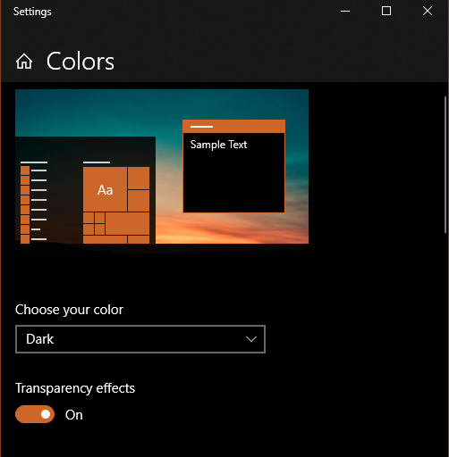

# Detect-OS-Color-Mood-Dark-Light Using CSS
=>> Goto windows 10 system theme/color settings and choose your color & then see the magic !!
<h3>System Color Settings In Windows 10

<h2>Dark Mood

<h2>Light Mood

